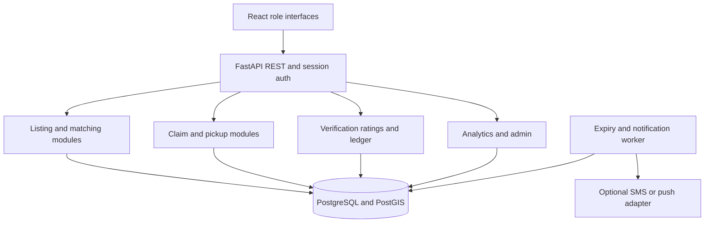

# Architecture and repository boundaries

Source baseline: PDF p. 7, [original figure](source/figures/architecture-page-07.png).
Implementation default: modular monolith; logically scoped zones in one PostgreSQL
database, not independent databases or a blockchain network.

## Modules to implement

| Boundary | Responsibilities | Suggested target |
| --- | --- | --- |
| Identity | Registration, Argon2id, opaque sessions, role verification | `apps/api/app/identity/` |
| Listings | CRUD, ownership, expiry, zone snapshots | `apps/api/app/listings/` |
| Matching | Geography, capacity, urgency ranking | `apps/api/app/matching/` |
| Claims | Locks, whole-listing allocation, idempotency, cancellation | `apps/api/app/claims/` |
| Pickups | Volunteer assignment, attempt history, pickup/delivery | `apps/api/app/pickups/` |
| Trust | Per-user append service, verifier, participant ratings | `apps/api/app/trust/` |
| Notifications | Transactional outbox, durable in-app inbox, adapter retries | `apps/api/app/notifications/` |
| Analytics | Zone/city aggregates and filtered report exports | `apps/api/app/analytics/` |
| Shared | Configuration, DB transaction context, errors, clock interface | `apps/api/app/core/` |
| Worker | Expiry sweeps and notification delivery loops | `apps/api/app/worker.py` |

Route handlers validate/serialize requests, services implement business operations,
and repositories execute queries within an explicit transaction. Avoid hidden
commits inside repositories. Use one database transaction for each domain command.

## Identity and database access

Use opaque server-side sessions in HttpOnly cookies. Local development uses Vite's
`/api` proxy to avoid cross-origin cookie surprises. Production cookies must be
Secure; protect cookie-authenticated writes with a CSRF token and origin checks.
Use Argon2id rather than inventing password hashing. Session IDs are random, stored
as hashes, revoked on logout, and expire after a documented policy interval.

The API uses a non-superuser, non-table-owner runtime database role. Each transaction
sets a transaction-local private session hash from the authenticated cookie. The
database resolves the actor and zone from its own session/user tables and ignores
raw actor/zone GUCs. Never accept a numeric impersonation context from a body/header.
FORCE RLS where applicable. Migration/seed and worker
roles have separate privileges; the worker has only the routines/tables it needs.
An authenticated session itself is not proof of verified role eligibility.

## Operational boundaries

Keep API and worker separately invocable but backed by the same codebase. Polling
is sufficient for the prototype's feed/inbox. Do not add Redis, a message broker,
microservices, Kubernetes, or paid map services without a demonstrated need.
Raw coordinates and a simple map/list view suffice; exact receiver and volunteer
addresses must not be published to arbitrary feed viewers.

Support request IDs and structured logs with IDs, errors, timing and transition
names. Exclude hashes, session contents, passwords, exact personal coordinates and
phone numbers. Provide liveness separately from database readiness. Never claim
zone availability independence while all transactions share one database process.
