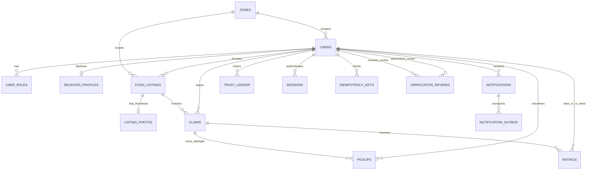

# Database implementation specification

Source schema: PDF pp. 8-11; examples pp. 11-13. Baseline revision `0001` implements
the schema and guarded claim foundation. Revision `0002` adds identity/session/CSRF
routines, private throttles/reviews and the guarded claim's CSRF wrapper.
Revision `0003` implements guarded workflows, task visibility, trust summaries,
expiry/outbox worker functions, pickup `accepted_at`, outbox lease tokens and indexes.
The same ER entities and ownership rules remain in use.
Executable SQL and course examples: [database/README.md](../database/README.md).
Use snake_case identifiers, BIGINT identity keys, NUMERIC for
mass, and TIMESTAMPTZ for times. Preserve the original eight entities; extensions
below resolve omissions in [ADR 0001](decisions/0001-prototype-design.md).

## Target ER model



## Data dictionary

Every column below is required unless marked nullable. References use restrictive
deletion for domain/audit records. Archive identities/listings rather than deleting
evidence. Sessions/outbox maintenance can use targeted cleanup rules.

| Table | Columns and constraints |
| --- | --- |
| `zones` | `zone_id` PK, `zone_name` varchar(60), `city` varchar(60), `pincode_range` varchar(20); UNIQUE(city, zone_name) |
| `users` | `user_id` PK, `zone_id` FK zones, `name` varchar(100), normalized `email` varchar(100) UNIQUE, normalized `phone` varchar(15) UNIQUE, `password_hash` text, `latitude` numeric(9,6), `longitude` numeric(9,6), `verified_status` bool false, `active` bool true, `created_at` |
| `user_roles` | `(user_id, role)` composite PK; role CHECK Donor/Receiver/Volunteer/Admin; `approved_at` nullable until admin verification, `approved_by` nullable FK users; admin grants must be bootstrap/admin-only |
| `receiver_profiles` | `user_id` PK/FK users, `capacity_kg` numeric(8,2) CHECK >0; per-claim maximum, not simultaneous warehouse inventory |
| `food_listings` | `listing_id` PK, `donor_id` FK users, `zone_id` FK zones (immutable snapshot), `food_type` varchar(80), `category` Veg/NonVeg, `quantity_kg` numeric(8,2) CHECK >0, `prepared_at`, `expiry_window_start`, `expiry_window_end`, `pickup_lat` numeric(9,6), `pickup_long` numeric(9,6), generated `pickup_location` geography(Point,4326), `status`, `created_at`, `updated_at` |
| `claims` | `claim_id` PK, `listing_id` FK listings, `receiver_id` FK users, `claimed_at`, `status` Confirmed/Cancelled/Expired/Completed, `ended_at` nullable, `cancellation_reason` nullable; Pending deferred because acceptance is synchronous |
| `pickups` | `(claim_id, pickup_id)` composite PK with claim FK, `pickup_id` identity partial key, `volunteer_id` FK users, `scheduled_time`, `accepted_at`, `actual_pickup_time` nullable, `delivery_time` nullable, `ended_at` nullable, `status` Scheduled/PickedUp/Delivered/Missed/Cancelled/Failed, `reason` nullable |
| `ratings` | `rating_id` PK, `claim_id` FK claims, `rater_id` FK users, `target_user_id` FK users, `score` smallint CHECK 1..5, `comments` varchar(300) nullable, `created_at`; CHECK rater != target; UNIQUE(claim_id,rater_id,target_user_id) |
| `trust_ledger` | `ledger_id` PK, `user_id` FK users, `sequence` bigint, `action_type` varchar(40), `ref_table` varchar(40), `ref_id` bigint, `claim_id` nullable FK claims, `occurred_at`, `payload` jsonb, `payload_version` integer, `prev_hash` char(64), `curr_hash` char(64); UNIQUE(user_id,sequence) |
| `notifications` | `notification_id` PK, `user_id` FK users, `event_id` text, `message` varchar(200), `type` varchar(30), `created_at`, `sent_at` nullable, `read_at` nullable; UNIQUE(user_id,event_id) |
| `notification_outbox` | `outbox_id` PK, `notification_id` FK notifications, `channel` InApp/SMS/Push, `status` Pending/Processing/Sent/Failed, `attempts` integer, `next_attempt_at`, `locked_until` nullable, `lease_token` uuid nullable, `last_error` nullable (redacted); UNIQUE(notification_id,channel) |
| `sessions` | `session_hash` PK, `user_id` FK users, `csrf_hash` nullable for old sessions, `created_at`, `expires_at`, `revoked_at` nullable; no raw session/CSRF values persisted; old sessions without CSRF digest cannot write |
| `idempotency_keys` | `(actor_id, operation, key)` composite PK, actor FK users, `request_hash`, `response_status`, `response_body` jsonb, `created_at`, `expires_at`; same key/body returns original result; mismatched body conflicts |
| `seed_runs` | `seed_name` PK, fixture SHA-256, UTC anchor, `created_at`; records repeatable synthetic imports |
| `auth_rate_limits` | hashed bucket PK, `window_start`, positive attempt count; private auth helper only |
| `verification_reviews` | review PK, target/admin FK users, verified flag, approved roles JSON, private reason, `created_at`; self/scoped Admin RLS |

## Constraints and indexes

- Latitude -90..90; longitude -180..180. Geography point order is longitude,
  latitude. Retain raw coordinates for source traceability, with one generated
  spatial representation rather than independently editable duplicate values.
- `prepared_at <= expiry_window_start < expiry_window_end`. Creation also requires
  `prepared_at <= database time` and a future expiry. Do not put `now()` into a
  supposedly immutable CHECK; enforce time-relative validity in routines/services.
- Constrained status values; verify related state and actor eligibility within
  guarded transaction routines. FK membership alone does not prove a donor role.
- Unique partial claim index on `(listing_id)` for `status IN ('Confirmed','Completed')`.
- Unique partial pickup index on `(claim_id)` for `status IN ('Scheduled','PickedUp','Delivered')`.
  Terminal failed/missed attempts retain history; a Delivered attempt prevents another.
- B-tree `(zone_id, status, expiry_window_end)` for listings. GiST on generated
  `pickup_location`. Index child FKs used for joins and access policies.
- `(receiver_id, claimed_at)`, `(donor_id, created_at)`, `(volunteer_id, status)`,
  `(user_id, sequence)` ledger, `(user_id, read_at, created_at)` notifications,
  `(status, next_attempt_at)` outbox. Verify plans rather than adding redundant indexes.
- Freeze allocation-relevant listing fields after claim; forbid arbitrary domain
  UPDATE privileges for API role if guarded stored routines are used.

Illustrative uniqueness migration fragment:

```sql
CREATE UNIQUE INDEX uq_claim_allocation ON claims (listing_id)
WHERE status IN ('Confirmed', 'Completed');

CREATE UNIQUE INDEX uq_pickup_live_or_delivered ON pickups (claim_id)
WHERE status IN ('Scheduled', 'PickedUp', 'Delivered');
```

## Transactions and database programmability

Implement guarded SQL routines or equivalently constrained service transactions for
claim, cancellation, accept-pickup and completion. Include at least one demonstrable
PL/pgSQL domain routine for course evidence. All status writes pass transition
guards; include a trigger to reject invalid transitions and protect ledger immutability.

Lock order for every command: listing -> claim -> pickup -> user rows in ascending
user_id -> idempotency/outbox records. Registration-only commands lock relevant users
in ascending order. Find IDs first, then lock in that order; recheck under locks.
Serialize idempotency using a transaction-level lock on (actor, operation, key)
before domain locks, consistently across all commands, and keep that lock class
separate from domain/user locks. Do not acquire a new domain lock after user locks.

1. Authenticate and parse the request outside the domain transaction.
2. Begin; set local private session-hash context; acquire idempotency serialization if used.
3. Lock listing with `SELECT ... FOR UPDATE`; lock related rows and actors as needed.
4. Recheck authorization, verification, source state, and deadline using
   `clock_timestamp()` after any lock wait. PostgreSQL `now()` is transaction-start
   time and must not authorize a claim that waited until after expiry.
5. Mutate listing/claim/pickup, append involved user events in sorted user order,
   create notification/outbox rows and persist idempotent response.
6. Commit; return the persisted response. Roll back everything on any failure.

Use bounded lock/statement timeouts and retry transient deadlocks once with the
same idempotency key. An integrity conflict becomes a domain 409, not a raw SQL error.
The unique indexes must reject bypass inserts even if an application check is missed.

Expiry worker uses small batches with locked rows and a documented lock order;
`SKIP LOCKED` can avoid blocking active commands. Compute time once after locking
each batch. Feed and command deadline checks remain necessary if the worker is down.

## Trust ledger

Per-user genesis `prev_hash` is 64 zeroes; first sequence is 1. Lock the associated
user before reading the tail, then append exactly one next entry. Sort involved user
IDs so a cross-party command cannot deadlock with another append. Do not update or
delete ledger entries through the runtime role.

Canonical envelope fields: `v`, `user_id`, `sequence`, `action_type`, `ref_table`,
`ref_id`, `claim_id`, `occurred_at`, `payload`, `prev_hash`. Encode as UTF-8 JSON with
sorted keys, compact separators, NFC strings, no floating point values, and UTC
timestamps with six fractional digits and `Z`. Mass values are fixed two-decimal
strings. `curr_hash = sha256(canonical_bytes).hexdigest()`; do not hash PostgreSQL's
text JSON representation and expect it to match Python serialization.

Persist enough information to reconstruct the exact envelope. Write a standalone
verifier that checks sequence, previous hash and computed hash and reports the
first broken entry. Tests include concurrent appends and payload tampering.
Hash chaining detects modification relative to a known intact head; it cannot stop
an operator rewriting the entire chain and all trusted heads. Future external
checkpointing is a separately documented extension.

Events include registration, verification/role changes, listing create/update/cancel,
claim confirm/cancel/expire/complete, pickup accept/start/deliver/fail/miss, ratings,
and explicit notification read changes. Delivery transport retry attempts are
operational logs rather than reputation events. Worker changes append to affected
users using a system actor marker in the payload. No PII or passwords in event payloads.

## Access control

RLS restricts zone/ownership/participant rows. Public user projections exclude
password/session data and precise personal locations. Privilege grants restrict
columns/tables as well as rows. Claims/pickups visible only to participants and
approved zone admins; listings visible to eligible zone participants; ratings follow
transaction visibility; inbox and own ledger default to self only. Admin audit
requires an approved scoped role. Test both direct SQL and API denial.

The database resolves `app.session_hash` through the private sessions table. It
ignores raw actor/zone settings, preventing runtime callers from impersonating a
zone admin by setting a numeric ID. P03 issues/revokes sessions through the separate
auth role and guards runtime writes with a stored CSRF digest. Definer helpers
belong to private NOLOGIN/BYPASSRLS `dbthon_guard`, with fixed search paths; runtime
has no membership in that role or EXECUTE on private append/notification helpers.
FORCE RLS can therefore query user/session data without recursive row policies.
Never grant the guard role to a login. P03 uses separate restricted auth/runtime
LOGIN accounts with only their own NOLOGIN group membership; transaction context
rejects an owner/superuser/BYPASSRLS/guard-member or dual-purpose login.

RLS context must use `SET LOCAL`/transaction-local `set_config` on every request so
pooled connections cannot leak identities. Do not run permission tests as a superuser
or owner who bypasses RLS. Avoid recursive users-table policies; use a restricted
helper or role projection with fixed search_path and carefully audited grants.

## Views, reports and normalization

Provide `zone_impact_summary`, `user_trust_summary`, and a read-safe listing projection.
Reports accept range parameters in queries, not baked into a global static view.
Preaggregate unique allocation/delivery records before joining ratings, ledger or
retry attempts so a listing's mass is counted once. Preserve zero-activity zones
with left joins. Group by zone_id/city/name, not name alone.

1NF: roles are rows in a junction table; coordinates and categories remain atomic.
2NF: role approval depends on `(user_id,role)` and pickup attributes depend on the
composite attempt key. 3NF: user contact and zone metadata are referenced, not copied
across transactional rows. Listing zone is an intentional historical snapshot,
independent of the donor's mutable current profile. Ratings/ledger records reference
their transaction. Verification review approved_roles is an intentional immutable-
at-creation audit snapshot, separate from normalized current role approvals.
Derived trust scores and report estimates are views, not manually
maintained counters. Describe any later denormalization with measured justification.

Technical references: [locks](https://www.postgresql.org/docs/17/explicit-locking.html),
[partial indexes](https://www.postgresql.org/docs/17/indexes-partial.html),
[geography filtering](https://postgis.net/docs/ST_DWithin.html),
[RLS](https://www.postgresql.org/docs/17/ddl-rowsecurity.html).

## Revision 0003 operations

`dbthon_command` accepts a fixed allowlist of listing/claim/pickup/rating/read commands.
The runtime has EXECUTE, not arbitrary DML. Request fingerprints and actor/operation/key
locks serialize retries; authorization is repeated after sorted domain/user locks,
including the participant's required role on rating replays. Worker-owned routines
find at most 100 due listings and commit each separately; notification leasing uses
SKIP LOCKED, 30-second UUID leases and five attempts. `accepted_at` records real volunteer
acceptance for participation reporting, independently of scheduled collection time.
Pending leases survive worker restarts. Retry delay is bounded exponential, up to an
hour; final failures remain inspectable in the outbox. No SMS/Push row is marked sent
without an external adapter. Idempotency records retain results for at least 24 hours;
pruning old retry rows is an operational follow-up, not performed by a user request.

## Managed owner compatibility (revision 0004)

The non-login guard role uses explicit FORCE RLS policies without BYPASSRLS on managed PostgreSQL. Bootstrap supplies temporary schema CREATE for ownership changes; migration 0004 revokes it. Runtime logins remain non-owners and cannot adopt guard. See [AWS/Render integration](AWS_RENDER_CONNECTION.md). No table/ER-key changes are introduced.


## Revision 0005: authenticated thumbnails and public aggregate impact

`listing_photos` is an optional one-to-one child of `food_listings`: listing_id
(PK/FK, cascade on deliberate listing deletion), thumbnail (bytea, 1–153600 bytes),
and updated_at (UTC timestamptz). The API independently decodes, bounds, resizes
and re-encodes a fresh JPEG at at most 800 px, stripping EXIF and other source
metadata. Runtime reads use FORCE RLS and verified same-zone listing visibility.
The runtime role has no direct DML grant. The sealed `dbthon_set_listing_photo`
command locks the listing and sorted affected users, rechecks CSRF/role/ownership,
uses idempotency, and records ledger/outbox rows atomically. Same-zone Admins can
remove a photo, including from terminal listings, but cannot upload for a donor.
Listing create/edit and an optional supplied photo commit in one API transaction.

`dbthon_public_impact` is a sealed read routine executable by the restricted auth
role. It exposes only global aggregate current-UTC-month delivered mass, meal
estimates, active-listing count, server time and demo-data provenance. It exposes
no person, contact, precise coordinate, listing ID, or per-zone breakdown. This
explicit public aggregate interface does not broaden private report access.
Revision 0004 is immutable; 0005 grants temporary schema CREATE for function owner
transfer and revokes it within the migration. No login gains guard membership.
