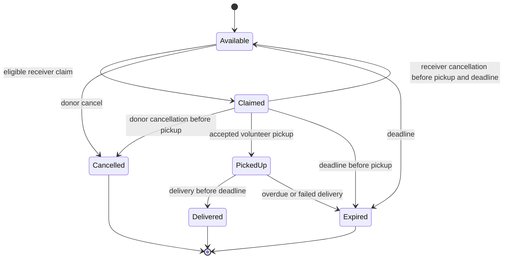

# Domain rules and edge cases

These are implementation defaults derived from the brief and ADR 0001. A donor's
deadline is supplied data, not a system guarantee that food is safe. Show prepared
time, category, quantity and deadline clearly; do not invent automatic safety windows.

## Eligibility and matching

Require active, verified actors with an approved role and a matching zone. Receiver
cannot equal donor. A Receiver role also needs a positive declared per-claim capacity.
Volunteer cannot be the donor or receiver on the same claim in the first prototype.
Admin is zone-scoped; no implicit global admin through user registration.

Candidate feed eligibility: `Available`, `expiry_window_start <= clock_timestamp()`,
`expiry_window_end > clock_timestamp()`, same zone, distance within radius, quantity
<= receiver capacity, donor active/verified. Use geography ST_DWithin in metres;
calculate exact distance on the filtered candidates. Default radius 5,000 m, maximum
5,000 m. This matches the guarded claim and alert radius; broader discovery is
deferred rather than advertising listings that the actor cannot claim. Rank `expiry_window_end ASC`, then `distance_m ASC`, then `listing_id ASC`.
This reproducible lexicographic rule resolves the unspecified ranking weights.
Volunteer task matching uses confirmed claim, deadline and same-zone proximity.

Return server time, distance and seconds remaining. A frontend countdown is advisory;
only server checks authorize actions. Warn at <=1,800 seconds. A stale open tab must
handle 409 conflict and refresh the listing.

## Listing lifecycle

Available edits require ownership and valid time/quantity data; any change can rerank
the feed and must create audit/notification events. Do not change donor/zone IDs.
Claimed listings cannot be edited. Expired, cancelled and delivered records are immutable.

## Claim lifecycle and cancellation

Successful claim creates `Confirmed` synchronously and changes listing to `Claimed`.
No placeholder Pending row is necessary. Completed delivery changes claim to
`Completed`; deadline expiry changes active claim to `Expired`; explicit permitted
cancellation changes it to `Cancelled`. Keep prior cancelled/expired rows.

Receiver may cancel only before actual pickup. Under listing/claim/attempt locks,
cancel any scheduled attempt and the claim; return listing to Available only if the
window remains open, else Expired. Donor cancellation before pickup terminates the
claim and scheduled attempt and sets Cancelled. Neither party silently releases food
already picked up. Admin can record a failed delivery/dispute with reason, without
relisting it. Partial claims and splitting are deferred.

## Pickup lifecycle

Confirmed claims expose an unassigned task. A verified volunteer accepts and creates
a Scheduled attempt with scheduled_time between current time and expiry. Competing
accepts lock the same listing/claim and only one succeeds. Pickup changes attempt to
PickedUp and records actual_pickup_time. Delivery changes it to Delivered with
delivery_time and completes listing/claim in the same transaction. Required ordering:
claimed_at <= actual_pickup_time <= delivery_time < expiry_window_end.

Scheduled attempt can be cancelled by its volunteer before pickup; claim remains
Confirmed and task reopens if time permits. A scheduled attempt not picked up within
a 15-minute grace (fixed prototype policy) is Missed, allowing a replacement attempt while the
claim remains valid. At expiry, scheduled attempts become Missed, active claims and
listings become Expired. A PickedUp attempt passing expiry becomes Failed and claim/
listing Expired. Preserve actual pickup time and failure reason; do not count it as
delivered. Recheck these conditions inside every command regardless of worker timing.

### Pickup time agreement

The volunteer's accepted schedule is proposal version 1 and counts as the
volunteer's confirmation. The donor and receiver must confirm that version before
collection. Any participant may propose a new time while the attempt remains
Scheduled; this increments the version, records the proposer as accepted and
invalidates every earlier confirmation. The other two participants must accept
the new proposal. Collection is rejected until exactly the three current
participants have confirmed the current version. All proposals remain associated
with `(claim_id,pickup_id)`; prior versions remain available for audit.

## Community requests and updates

Only approved Receivers create same-zone needs with a positive target quantity
and future deadline. Needs are visible inside their zone to authenticated
members. An approved Donor can link one of their own live zone listings; the
listing is still claimed whole through the normal receiver flow and rechecks
capacity, distance, eligibility and deadline under the existing listing lock.
Multiple completed offers may satisfy a target; merely linking or claiming an
offer does not. Owner closure, a zone Admin closure with reason, reaching the
needed-by time, or completed deliveries meeting the target closes the need.

Zone Admins may publish announcements and curated partner resources with
optional HTTPS links and end times. Approved members may suggest the same
content, but suggestions stay unpublished until an admin publishes or rejects
them with a reason. Signed-in members, including pending members, can read
current published updates in their own zone. Every mutation uses the standard
guarded command, idempotency, CSRF, trust-ledger and inbox outbox transaction.

## Ratings and reputation

Only the donor and receiver on a Completed claim may rate each other, once per
direction, score 1-5, maximum 300 comment characters. No self/volunteer/stranger
rating in the initial scope. Return average received score and count; no rating means
null average, count zero, not a misleading zero trust score. Verification and ratings
are different concepts. Ratings create events for both affected user chains.

## Notifications and retries

Commit inbox/outbox rows with the domain event; worker delivers after commit. Match
creation recipients by the same eligibility logic as the feed. Status-change alerts
go to affected participants. Unique event/user/channel keys prevent duplicate local
entries. Worker leases Processing rows and retries expired leases after crashes.
Use bounded exponential backoff and a dead-letter state after documented maximum
attempts. External providers can redeliver; use provider idempotency when available,
otherwise promise at-least-once transport rather than exactly-once SMS.
Do not mark Sent for an adapter that only logged a message. In-app delivery and
external delivery statuses are distinct.

## Impact definitions

Date range is half-open `[from,to)` in UTC; report date inputs and exports label UTC.
Other workflow timestamps display the device timezone.

| Metric | Definition |
| --- | --- |
| Listings created | Distinct listings created in range, grouped by immutable listing zone |
| Confirmed claims | Distinct successful claim confirmations in range, including those subsequently Completed; show later cancellations separately |
| Picked-up kg (source metric) | Sum one full quantity per listing with actual pickup in range, including later failures, explicitly labelled picked up |
| Delivered kg | Sum one quantity per listing with successful delivery in range; retry joins cannot duplicate it |
| Estimated meals-equivalent | Delivered kg / configured 0.4 kg per meal; display estimate and factor; source picked-up equivalent can be a separate labelled column |
| Estimated CO2e avoided | Delivered kg * configured kgCO2e/kg; null plus missing-factor note until a supported factor is supplied |
| Participation | Distinct donors with listing creation/state-update in range; receivers with claim/ending/actual-pickup in range; volunteers with acceptance/pickup/delivery/ending in range. Each role is counted once per row; do not sum daily counts as unique people |
| Average time-to-claim | Average successful claimed_at-created_at in seconds; report sample count and chosen range on claimed_at |

Do not present meal-equivalent as observed meals served or estimates as measured
environmental savings. Record factor version/source alongside exported reports.

## Daily donation routines and donor declarations

A schedule generates a daily reminder, never an unconfirmed available listing. The
donor opens a fresh template and confirms today's actual surplus, quantity, window,
storage, packing and ingredients. Repeated listings do not reuse checklist answers.
Only current active, verified Donors in the template's zone receive reminders; stale
missed occurrences advance to the next local day instead of sending a backlog.

Halal/Jain/nut-free are donor assertions, not certifications. Nut-free cannot coexist
with declared peanuts/tree nuts. No known allergens does not prove allergen absence
or exclude cross-contact. Existing listings without declarations stay visibly unknown.
Allergen-exclusion filtering never treats an undeclared listing as allergen-free.

External alerts require explicit channel consent and current active account, and are
restricted to one configured demonstration phone. Domain/audit/outbox commit together;
network calls happen afterward. Provider acceptance does not prove device delivery.

## Community experience privacy

Saving does not reserve or change listing eligibility. Messages require current
verified participation and an original recipient snapshot; replacing volunteers
never exposes old conversations. Only explicit report-attached message evidence is
visible to scoped administrators. Reports have no automatic allocation, trust-score
or safety-certification side effect. Own impact counts unique delivered listings;
role subtotals may overlap. Calendar files are user-downloaded snapshots and do not
replace the current pickup agreement.

## Personal impact score

My impact displays a contribution score for the selected 30, 90 or 365-day period:
`round(delivered_kg * 10)` points. It uses the authenticated personal-impact API's
unique delivered-listing total in the current zone, never a sum of overlapping role
subtotals. Picked-up but undelivered food earns no points. Progress shows the next
100-point milestone; changing period recalculates both score and milestone.
This is a presentation metric, not a stored balance, trust score, ranking, reward
or independently measured social impact. Demo activity stays explicitly labelled.
Scores are hidden while a fresh period loads or the API returns an error.

## Permanent account deletion

Users may delete their own account, including before verification. Approved admins may delete members under their existing area permissions; the named main admin retains global scope. Require the current account email as explicit confirmation and CSRF/Origin validation. Protect the main administrator and the last active approved admin in each area. Reject deletion while donor listings are Available/Claimed/PickedUp, receiver claims Confirmed or volunteer attempts Scheduled/PickedUp; finish, cancel or expire these first.

Deletion removes personal profile and login details and private preferences permanently. Retain a pseudonymous inactive identity for historical exchanges and immutable audit references; do not cascade away another participant's records or rewrite ledger hashes. Close open requests and invalidate pending alerts. Historical user-written content remains. Deleted identities cannot regain access; registering again creates a new identity requiring ordinary verification.

## Membership rejection and administrator requests

A scoped admin may reject an unverified application with a required reason. The applicant can still sign in and read the explicit Rejected status/reason in their account and inbox, but receives no verified-role capabilities. Revocation of a previously approved account is a separate decision.

Only an approved active member with an approved community role and without Admin access can apply for administrator access. Require a 10–500-character reason, only one Pending request and at most one submission per 24 hours. Notify active area admins and the main global admin. Existing admins read the full reason and either approve through normal guarded delegation or reject with a visible 3–300-character reason. Rejecting an admin-access request does not revoke the member's public roles. Approval never occurs through public registration.
